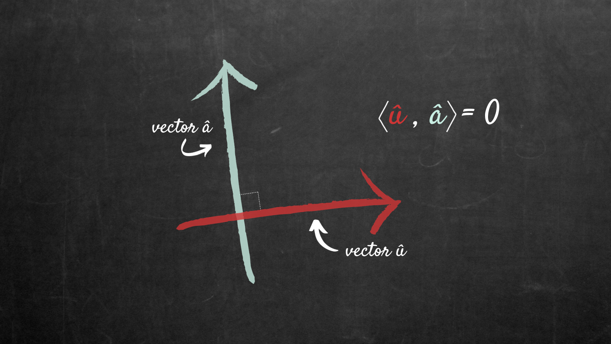

# BASES DE DATOS PARA PRINCIPIANTES

## CONCEPTOS BÁSICOS 

Una base de datos es una herramienta que permite almacenar datos de forma estructurada.

Cuando hablamos de bases de datos, vamos a hablar de entidades que nosotros creamos y diseñamos para resolver problemas de todo tipo: tu presupuesto personal, el registro de nóminas en un trabajo, la biblioteca pública, la agenda telefónica, etc. Si te fijas bien encontramos bases de datos en todas partes. 

Al ponernos manos a la obra y crear una base de datos, es muy importante que entendamos cabalmente el problema, de manera que aseguremos que el diseño de la base de datos será el más óptimo para solucionar cualquier problema que se nos ponga en el camino. 

### **SOFTWARE**

Existen programas que permiten diseñar y construir bases de datos de manera más amigable e intuitiva. Vamos a empezar por uno que conocemos todos: 


**Excel**

Microsoft Excel es un programa que nos permite editar hojas de cálculo, a través de libros abiertos. Ni más, ni menos.
Tiene algunas limitaciones, sin embargo, es bastante útil y nos servirá de ayuda en más de una ocasión. 
Debemos considerar que:

- El tamaño de las hojas de cálculo es de 1,048,576 filas y 16,348 columnas.

- Cada celda puede contener un total de 32,767 caracteres.

- El número de campos en un formulario es de 32.

También es importante mencionar que Excel no poseé integridad referencial, es decir que podemos encontrar datos duplicados dentro del mismo libro, en diferentes hojas. 

Excel nos da la ventaja si estamos manejando pequeños volúmenes de datos, permite recolectar datos, filtrarlos, hacer búsquedas rápidas y aplicar operaciones.

 - Fórmulas versátiles

 - Funciones aplicables a subconjuntos de datos seleccionados.

 - Fucionalidades de gráficos, lo que nos permite visualizar nuestra información de forma sencilla y más fácil de explicar. 

También econtraremos Sistema Gestores de Bases de datos (Database Management Systems  por sus siglas en inglés), más completos y también más complejos, aquí una pequeña lista de los más usados:

<a href="https://dev.mysql.com/doc/" target="blank"></a> 

**MySQL**

Este software es un es un sistema gestor de bases de datos relacionales relacionales, de código abierto que nos permite almacenar, gestionar, y recuperar datos estructurados de manera eficiente. Se usar en proyectos de pequeña y gran escala.

<a href="https://www.postgresql.org/docs/" target="blank"></a>

**PostgreSQL**

PostgresSQL o solo Postgres es un sistema de bases de datos de modelo objeto-relacional. Es muy estable y robusto, con 20 años de colaboración en su desarrollo al ser de código abierto, lo que contribuye directamente a su resitencia, integridad y exactitud.

<a href="https://docs.oracle.com/en/database/oracle/oracle-database/" target="blank"></a>

Oracle puede trabajar con lenguajes PL/SQL y SQL para escribir consultas (queries), para acceder a los datos que se encuentra alojados en su base de datos. 

Dale click en los íconos para ver la documentación.

## BASES DE DATOS RELACIONAL

Un modelo relacional representa conjuntos que tienen relación entre ellos en un arreglo bidimensional, en forma de tablas. Se pueden pensar como una hoja de Excel. 

Cada relación tiene un conjunto nombrable de atributos que encontraremos en las columnas y valores para cada atributo en cada una de las filas (tuplas) de nuestra tabla:

| Atributo 1| Atributo 2|... | Atributo n |
|:---------:|:---------:|:--:|:----------:|
|Valor 1.1  | Valor 2.1 |... | Valor n.1  |
|Valor 1.2  | Valor 2.2 |... | Valor n.2  |
|Valor 1.3  | Valor 2.3 |... | Valor n.3  |
|     ⋮     |⋮           |⋮   | ⋮           |
|Valor 1.n  |Valor 2.n  |⋮   | Valor n.n   |

Las bases de datos relacionales cuentan con: 

- **Esquema (scheme)** : es una descripción estructural de de las relaciones en la base de datos.

- **Instancias (instances)**: son todos aquellos elementos que conforman al contenido en un tiempo determinado. 

- **Claves (Keys)**: Keys es un tipo de atributo especial porque su valor es único dentro de la tupla, son idetificadores, es importante aclarar que una clave puede ser una combinación de atributos. 

En SQL podemos pensar que una tabla es un tipo de entidad, y que cada columna es una instancia específica del tipo de entidad.

## SQL

### Consultas (Queries)

Para poder extraer información de una base de datos SQL necesitamos seleccionar que parte de la tabla, así como de que tabla, estaremos obteniendo la información, en SQL lo hacemos a través de la siguiente instrucción:

``` sql:
SELECT columna, otra_columna FROM mi_tabla;
```

También podemos seleccionar toda la tabla con un asterisco: 

```sql:
SELECT * FROM my_table;
```
Ahora, si tenemos una tabla con miles de filas y solo necesitamos cierta información, la palabra reservada ```WHERE```

``` sql:
SELECT columna, otra_columna FROM mi_Tabla
WHERE condición, AND/OR otra_condición;
```

Podemos usar tantas columnas y tantas condiciones como sean necesarias para nuestra consulta, aun más, se pueden construir cláusulas mucho más complejas combinando operadores lógicos.

Algunos de estos operadores son: 

|Operador         | Condición          | Ejemplo en SQL |
|-----------------|--------------------|----------------|
|=, !=,<,>, =<, =>| Operadores estándar numéricos| nombre_columna != Juan|
|BETWEEN ... AND ...| El valor está dentro de un rango definido (inclusivo)| nombre_columna BETWEEN 27 AND 37|
|IN(...)   | Valor existente en una lista| nombre_columna IN (12, 13, 101)|
NOT IN (...)| Valor que no existe en una lista| nombre_columna NOT IN (22, 17, 303)|
| LIKE | Comparación exacta de cadenas (case sensitive)| columna_nombre LIKE "Maria"|
|NOT LIKE| Comparación exacta de cadenas diferentes (case senstive)| colmna_nombre NOT LIKE "gmail"|

No debemos olvidar que para que el analizador de queries pueda distinguir que estamos hablando de una cadena debemos usar comillas ``` "..." ```

[Apache Lucene](https://lucene.apache.org/) or [Sphinx](https://sphinxsearch.com/) son implemenmtaciones para bases de datos que se especializan en busquedas del tipo full-text

## Filtrar y ordenar datos en una consulta

En el álgebra relacional veremos que las relaciones excluyen valores repetidos, sin embargo en SQL tenemos que darle instrucciones para filtrar elementos este tipo de elementos usando la palabra reservada ``` DISTINCT ```. 

```
SELECT DISTINCT columna, otra_columna, ... FROM mi_tabla WHERE condicion(es);
```

>NOTA: Considera que la instrucción ```DISTINCT``` remueve indiscriminadamente todos las columnas duplicadas.

Para ordenar los datos dentro de una tabla tenemos otra claúsula:  ```ORDER BY```, que permitirá ordenar los valores de manera acendente o decendente. 

```
SELECT columna, otra_columna, … FROM mi_tabla WHERE condicion(es) ORDER BY columna ASC/DESC;
```

Cuando ordenamos los datos de también podemos acotar el número de columnas con ```LIMIT``` y especificar donde empezar a contar el número de columnas con ```OFFSET```:

```
SELECT columna, otra_columna, …
FROM mi_tabla
WHERE condicion(es)
ORDER BY columna ASC/DESC
LIMIT num_limite OFFSET num_compensacion;
```

# Consultas  en multi-tablas por medio de uniones (JOINs)

Cuando trabajemos con datos en el mundo real normalmente utilizaremos más de una tabla. Por eso es importante que sepamos manejar multiples tablas ortogonales al mismo tiempo con un proceso al que llamaremos *normalización*.

Ahora, los sistemas ortogonales vienen a la programación desde las matemáticas puras, particularmente de la geometría y el álgebra, y decimos que dos lineas son ortogonales cuando se encuentran en un ángulo de 90° y hablando de álgebra es cuando dos vectores son independientes entre sí.

 

Ahora, en programación que dos elementos seaorotogonales dentro de un sistema implica que serán independientes entre sí.

Dentro de las bases de datos la ortogonalidad nos permitirá ordenar los datos a través de la normalización.La idea es establecer reglas para que la base de datos sea más flexible, más segura y eliminar redundancia y dependencias incoherentes.

Por ello es importante que aprendamos como funcionan las consultas cuando usamos múltiples tablas. 

### JOINs

Cuando varias tablas comparten información entre ellas, es necesario tener una *clave principal* (primary key) que identifique de manera inequívoca a cada entidad de la base de datos. Normalmente se utilizan enteros de forma incremental, pero las claves principales pueden ser cadenas, hash values, lo único que importa es que sean únicas.
Utilizaremos la palabra reservada ```JOIN``` para combinar los datos de una columan  a través de tablas separas usando la clave única de cada una de las tablas.

- ```INNER JOIN``` Se trata de un procedimiento que posibilita la unión de registros de dos tablas en caso de que compartan valores en un campo común.

```
SELECT columna, otra_columna, ...
FROM mi_tabla
INNER JOIN otra_tabla
    ON mi_tabla.id = otra_tabla.id
WHERE condicion(es)
ORDER BT columna, ... ASC/DESC
LIMIT limite_superior OFFSET limite_inferior;
```
